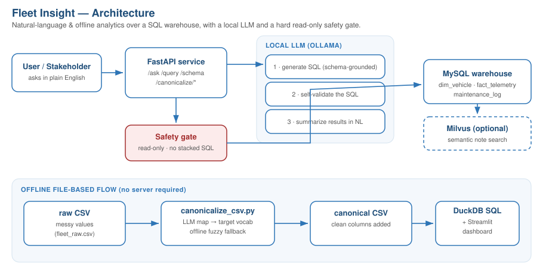
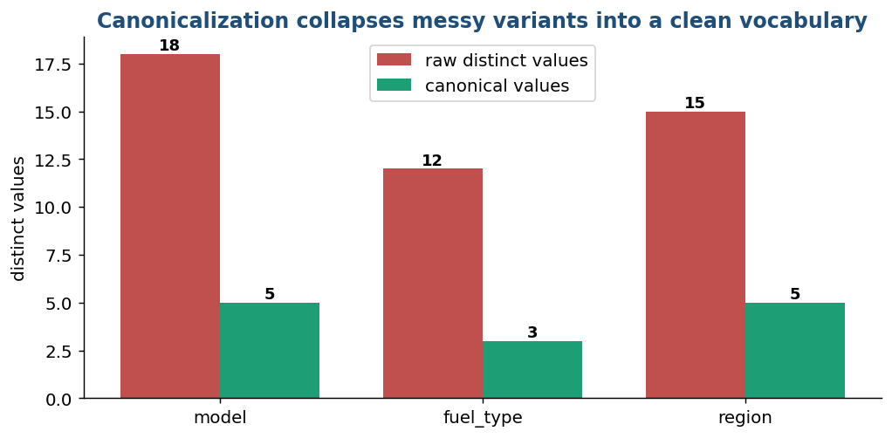

# Fleet Insight — AI-Augmented SQL Analytics

> Ask questions in plain English, clean up messy categorical data with a local LLM, and query or visualize the result — over a SQL warehouse, with a hard read-only safety gate.

A compact, end-to-end analytics service that combines **natural-language → SQL**, **LLM-powered data canonicalization**, and an **offline file-based analytics flow** (SQL-on-CSV + dashboard). Everything runs **locally** with [Ollama](https://ollama.com) — no API keys, no cloud.



---

## What it does

1. **Natural-language analytics** — `POST /ask` with a question; a local model writes the SQL, validates it, runs it against MySQL, and returns the rows plus a plain-English answer.
2. **LLM data canonicalization** — map messy free-entry values (`"Volvo FH16"`, `"fh-16"`, `"DSL"`, `"Sth"`) to a clean target vocabulary, with anything that doesn't fit routed to `Other`. Available both as an API endpoint (writes a non-destructive cleaned **view**) and as an offline CSV script.
3. **Offline analytics flow** — canonicalize a CSV, then query it with **DuckDB SQL** (no database server) or explore it in a **Streamlit dashboard**.
4. **Safety by design** — the LLM proposes; deterministic code decides. A structural gate blocks anything that isn't a read-only query, and the controlled vocabulary is enforced in code so a misbehaving model can't produce invalid values.

---

## Demo

### 1 · Ask a question in plain English

```bash
curl -X POST localhost:8000/ask \
  -H "Content-Type: application/json" \
  -d '{"question": "Which vehicle model has the most fault events?"}'
```

```json
{
  "question": "Which vehicle model has the most fault events?",
  "sql": "SELECT model, COUNT(*) AS fault_events FROM fact_telemetry t JOIN dim_vehicle v ON t.vehicle_id = v.vehicle_id WHERE fault_code IS NOT NULL GROUP BY model ORDER BY fault_events DESC",
  "summary": "The model with the most fault events is eCanter (36 events).",
  "columns": ["model", "fault_events"],
  "row_count": 5
}
```

The model is grounded in the **live schema** (introspected at request time), so it references real tables and columns rather than hallucinating them.

### 2 · Canonicalize messy data

Real input → output from the included sample (`data/sample/`):

| `model_raw` | → `model` | `fuel_raw` | → `fuel_type` | `region_raw` | → `region` |
|---|---|---|---|---|---|
| `Volvo FH16` | **FH16** | `DSL` | **Diesel** | `Sth` | **South** |
| `fh-16` | **FH16** | `EV` | **Electric** | `N` | **North** |
| `Mercedes eActros` | **eActros** | `hyb` | **Hybrid** | `cen` | **Central** |
| `hyb-x` | **Hybrid-X** | `electric` | **Electric** | `E` | **East** |

Across the sample, **45 distinct messy values collapse into a clean vocabulary** with zero misclassifications:



### 3 · Query the cleaned data with SQL — no server needed

```bash
python scripts/query_canonical.py
```

```
=== Fault rate by fuel type ===
fuel_type  vehicles  faults  avg_faults_per_vehicle
   Hybrid        14    37.0                    2.64
   Diesel        23    54.0                    2.35
 Electric        13    22.0                    1.69
```

Or run any SQL against the CSV:

```bash
python scripts/query_canonical.py --sql \
  "SELECT region, COUNT(*) n FROM fleet GROUP BY region ORDER BY n DESC"
```

These aggregations are only meaningful **because** the data was canonicalized first — `GROUP BY model` on the raw column would fragment `FH16` across five different spellings.

### 4 · Dashboard

```bash
pip install -r requirements-analytics.txt
streamlit run scripts/dashboard.py
```


---

## How it works

### The NL-to-SQL pipeline

```
question ─▶ introspect schema ─▶ LLM generates SQL ─▶ LLM self-validates
        ─▶ structural safety gate ─▶ execute (read-only) ─▶ LLM summarizes
```

### Two-layer safety

The headline design principle is **"never trust the model alone."**

- **Layer 1 (LLM):** the model reviews its own SQL and reports whether it's safe and valid. Smart, but not authoritative.
- **Layer 2 (code):** a deterministic gate (`app/db.py:is_safe`) is the real block — it rejects anything that doesn't start with `SELECT`/`WITH`, blocks stacked statements, and refuses write/DDL keywords. This is what actually protects the database.

The same philosophy governs canonicalization: the LLM proposes a mapping, but code snaps every result to the allowed target vocabulary (or `Other`), so invalid values are impossible by construction.

### Project structure

```
fleet-insight/
├── app/
│   ├── main.py          FastAPI: /ask, /query, /schema, /canonicalize/*, /health
│   ├── llm.py           Ollama: generate SQL → self-validate → summarize
│   ├── db.py            MySQL access + read-only safety gate
│   ├── schema.py        live schema introspection (grounds the LLM)
│   ├── canonicalize.py  value canonicalization + non-destructive cleaned VIEW
│   ├── semantic.py      optional Milvus semantic search over maintenance notes
│   └── config.py        env-driven settings
├── scripts/
│   ├── generate_data.py     synthetic fleet warehouse data
│   ├── load_mysql.py        create schema + load
│   ├── canonicalize_csv.py  offline CSV canonicalization (LLM + fuzzy fallback)
│   ├── query_canonical.py   DuckDB SQL over the canonical CSV
│   └── dashboard.py         Streamlit dashboard
├── data/sample/         committed sample raw + canonical CSVs
├── sql/schema.sql       star schema (dim_vehicle, fact_telemetry, maintenance_log)
├── Dockerfile · docker-compose.yml
└── requirements.txt · requirements-analytics.txt
```

---

## Quickstart

Install [Ollama](https://ollama.com) and pull a model first (used in all modes):

```bash
ollama pull qwen2.5-coder:7b
```

### Option A — Docker (one-command stack)

Brings up the FastAPI app + MySQL together; the app reaches Ollama on the host.

```bash
docker compose up --build -d
docker compose exec app python scripts/generate_data.py
docker compose exec app python scripts/load_mysql.py
curl localhost:8000/health
```

### Option B — Local

```bash
docker compose up -d mysql          # or use any MySQL / MariaDB
pip install -r requirements.txt
python scripts/generate_data.py
python scripts/load_mysql.py
uvicorn app.main:app --reload       # docs at http://localhost:8000/docs
```

### Offline flow (no MySQL, no Ollama required)

The CSV scripts run anywhere — `canonicalize_csv.py` falls back to a fuzzy matcher if Ollama isn't reachable:

```bash
python scripts/canonicalize_csv.py --in data/sample/fleet_raw.csv \
                                   --out data/sample/fleet_canonical.csv
python scripts/query_canonical.py
```

See [`RUNNING.md`](RUNNING.md) for the full command reference.

---

## Use it on your own data

**For the offline CSV flow** — point the script at your file and edit one config block:

```python
# scripts/canonicalize_csv.py
COLUMN_CONFIG = {
    "your_messy_column": {
        "targets": ["Clean Value A", "Clean Value B", ...],
        "out": "your_clean_column",
    },
}
```

```bash
python scripts/canonicalize_csv.py --in your_data.csv --out your_data_clean.csv
python scripts/query_canonical.py --csv your_data_clean.csv --sql "SELECT ..."
```

**For the API** — load your tables into MySQL (any schema). The `/ask` endpoint introspects the schema automatically, so NL-to-SQL adapts to your tables with no code changes. For `/canonicalize/propose`, pass your `table`, `column`, and `targets` in the request body.

---

## Tech stack

| Area | Tools |
|---|---|
| API | FastAPI, Uvicorn, Pydantic |
| LLM | Ollama (local) — `qwen2.5-coder`, `nomic-embed-text` |
| Database | MySQL 8 (MariaDB-compatible) |
| Offline analytics | DuckDB (SQL-on-CSV), pandas, Streamlit |
| Vectors (optional) | Milvus + Ollama embeddings |
| Infra | Docker, Docker Compose |

---

## Notes & roadmap

- **Descriptive analytics by design** — the service answers "what happened," not "what will happen." A forecasting endpoint is a natural next addition.
- **Local-first** — no external API calls; everything runs on your machine via Ollama.
- The included data is **synthetic** and generated deterministically (`scripts/generate_data.py`).

---

<sub>Built with an AI-augmented workflow (Windsurf, Claude). Local LLM inference via Ollama.</sub>
